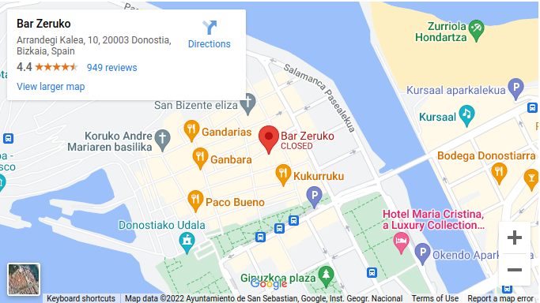
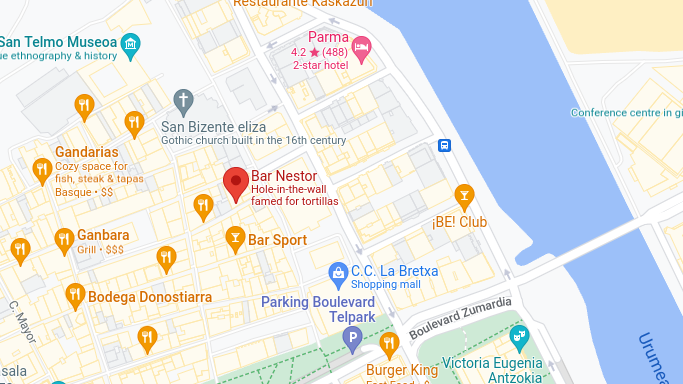
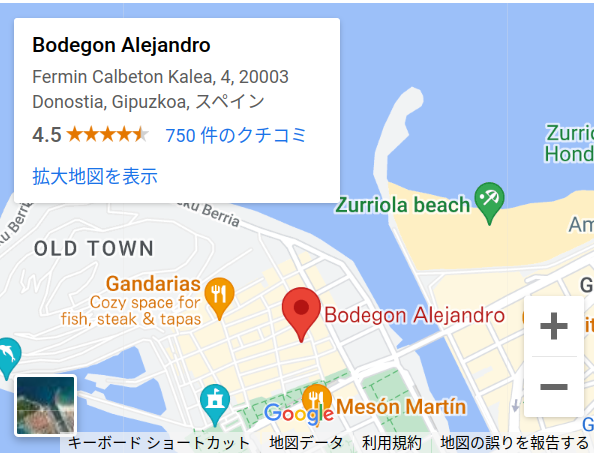
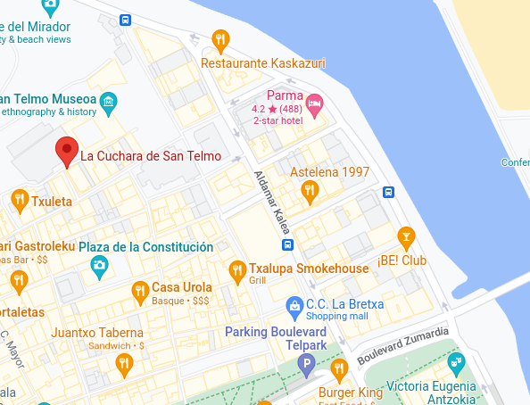
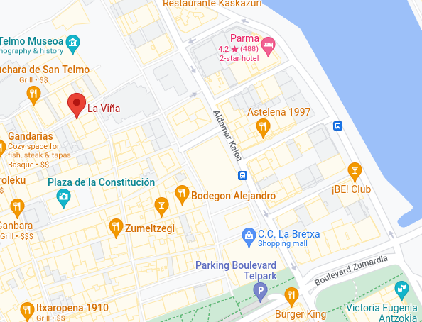

# サンセバスチャン旅行計画

2022年6月中頃、バスク地方を旅行する

## 概要

- [やりたい事](#やりたい事)
- [やりたくない事](#やりたくない事)
- [日程](#日程)
- [宿泊施設情報](#宿泊施設情報)
- [予算](#予算)
- [コロナ規制](#コロナ規制)
- [TODO-LIST](#TODO-LIST)
- [レストラン情報](#レストラン情報)
- [バスク地方に関する記事](#バスク地方に関する記事)
- [移動についてまとめ](#移動についてまとめ)
- [雑多なメモ](#雑多なメモ)

## やりたい事

- ビーチでゆっくり
- ミシュランのお店

## やりたくない事

- 観光で動きまくること

## 日程

June 2022

| Su | Mo | Tu | We | Th | Fr | Sa |
|----|----|----|----|----|----|----|
|    |    |    | 1  | 2  | 3  | 4  |
| 5  | 6  | 7  | 8  | 9  | 10 | 11 |
| 12 | 13 | 14 | 15 | 16 | 17 | 18 |
| 19 | 20 | 21 | 22 | 23 | 24 | 25 |
| 26 | 27 | 28 | 29 | 30 |    |    |

StuttgartとBilbao間のフライトが月曜便、水曜日、金曜日しかない。なので、金曜日発、月曜日帰りが良いだろう。

- 6月17日(金): 出発(10:50発、12：55着)
- 6月17日(金): San Sebastián泊
- 6月18日(土): San Sebastián泊
- 6月19日(日): Bilbao泊
- 6月20日(水): 帰宅(9:25発、11：25着)

## 宿泊施設情報

色々あるのは見かけたが、具体的にどことは決めていない。

- 6月17日(金): Hotel Bed4U Zurriola San Sebastian, 175 euro / person
- 6月18日(土): Hotel Bed4U Zurriola San Sebastian, 175 euro / person
- 6月19日(日): Holiday Inn Express Bilbao Airport, 85 euro / person

## 予算

ざっくり見積もり: 980 euro(13万程度)

- 往路フライト: 80 euro
- ホテル: 180 euro
- ホテル: 180 euro
- ホテル: 90 euro
- 復路フライト: 150 euro
- 食事代: 1食(20euro)x3x5=300 euro

フライト代は、加藤が今の所支払い済み。逸見さんに請求する。
ホテルは事前払いなし、予約だけ加藤が行った。

## コロナ規制

Spainはほぼ規制が無い事を確認。細かい情報は次のファイルを参照

[コロナ情報](2022_Jun_Corona_info_Spain.md)

## TODO-LIST

- コロナ規制確認（主に入国とホテル）
- 空港と街の移動の確認
- 行きたいレストランを決める
- 済：ホテル予約
- 電車予約（どの電車に乗るか確認する）
- 済：有休申請
- 荷造り

## レストラン情報

色々情報があるので整理できていないが、次のレストラン（バル？）が良さそうだ。

- [ZERUKO](https://www.happytraveler.jp/2018/09/zeruko.html)
- [NESTOR](https://ameblo.jp/s065319f/entry-12580428156.html)
- [Bodegon Alejandro](https://getnews.jp/archives/2185623)
- [La Cuchara de San Telmo](https://live-a-little.com/travelreport/2018/12/15/%E4%B8%96%E7%95%8C%E3%81%AE%E3%82%82%E3%81%86%E4%B8%80%E5%BA%A6%E8%A1%8C%E3%81%8D%E3%81%9F%E3%81%84%E3%83%AC%E3%82%B9%E3%83%88%E3%83%A9%E3%83%B3%E3%80%80la-cuchara-de-san-telmo%E3%80%80%E3%82%B9/)
- [Bask official](https://www.sansebastianholidays.com/jp/culinary-heaven-michelin-stars.php)
- [BAR LA VINA](https://www.tripadvisor.jp/Restaurant_Review-g187443-d11543572-Reviews-Bar_La_Vina-Seville_Province_of_Seville_Andalucia.html)

### ZERUKO

分子料理のお店らしい。タラ、ウニのピンチョスが美味しそう。

### NESTOR

Tボーンステーキが有名

### Bodegon Alejandro

ミシュランプレートのお店。星はないが一品一品がハイクオリティと称されているお店。カジュアルな、郷土料理らしい。

### La Cuchara de San Telmo

フォアグラが4.5ユーロで食べれるそう。2人なら小皿で十分とのこと。もちろん、中皿、大皿もある。
旧市街の北の方にあり、名物は絶品タコ料理。

### BAR LA VINA

バスク名物のチーズケーキで有名らしい。しかし見つかりにくいところにあり、人気も高いお店ではない。ただ、レビュー自体は高いようだ。
バル巡り締めのデザートに立ち寄る人も多いとのこと。

## バスク地方に関する記事

- [美食倶楽部](https://cuisine-kingdom.com/sansebastian/)
- [オススメのバルまとめサイト](https://www.travel.co.jp/guide/article/26316/)

## 移動についてまとめ

以下のソースをもとに情報を整理する。

- [ビルバオ空港から市街地まで](https://tamaslog.com/bilbao-airport-to-innerccity/)
- [ビルバオ空港からサンセバスチャンへ](https://tamaslog.com/bilbao-san-sebastian-bus/)

まずは、基本の移動はバスである。今回ホテルのサービスを見ると空港からタクシーが含まれているように見えるが、これは要確認だ。
だいたいこう言うのはうまくいかないので、バスの路線などについてきちんと確認しておこう。

まず、サンセバスチャン(San Sebastian)はバスク語でDonistiaと記述するらしい。
そして、Salida(出発)とLlegada(到着)と言う文字がわかれば、バス停の電光掲示板の読み方がわかるだろう。

考えているのは、初日は空港からサンセバスチャンへ。最終日はサンセバスチャンからビルバオ市街地へ行き観光。ホテルのあるサンセバスチャン空港へバスで移動ということだ。
このため、バスチケットの買い方とバス停を把握しておけば、だいたいなんとかなるだろう。

- [ALSA](https://www.alsa.com/en/web/bus/coach/bilbao-san-sebastian)
- [PESA](https://www.pesa.net/pesa/en/horarios)

ALSAは本数が少なく、価格が安い。PESAは本数が多いが価格が10ユーロくらい高い。
どちらもサンセバスチャンとビルバオ市街をつないでいる。そしてバス停は、Bilbao Intermodalと言うらしい。

空港情報がイマイチ見つからないが、空港からビルバオ市街は同じツールで検索できそうだ。

- [空港からサンセバスチャンへ](https://manpukutabi.com/bilbao_to_sansebastian_by_bus/)

つまり、PESAでは空港の名前がスペイン語で書いてあるので、どこにあるかわかりにくいということだろう。

## 雑多なメモ

- ラコンチャビーチ(ビルバオ)：最終日にBilbao観光するならここか。
- ビスカヤ橋：これもBilbaoの観光地。世界最古の運搬橋だそう。
- サンセバスチャンはビルバオからバスかタクシー。バスは朝は5ユーロ。昼は10ユーロ。地下にバス停あり。
- 両都市をつなぐバスの運行時間は1時間15分くらい
- サンセバスチャンには、山登り（お城あり）アクティビティもある。
