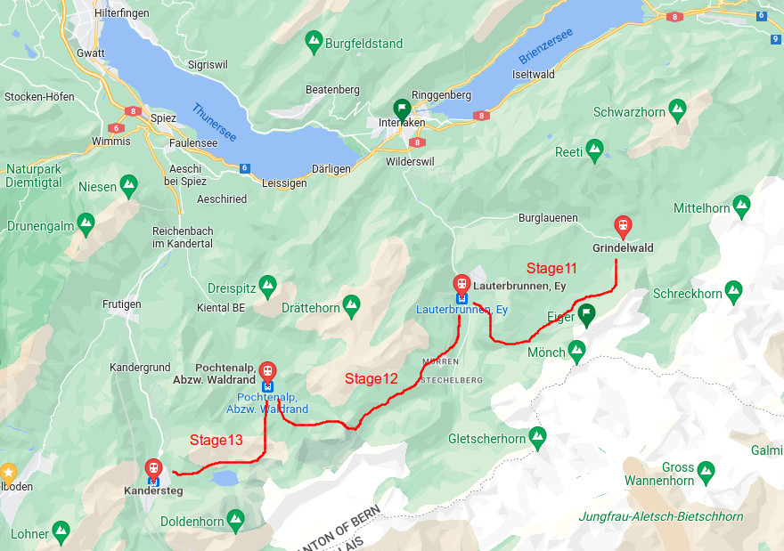
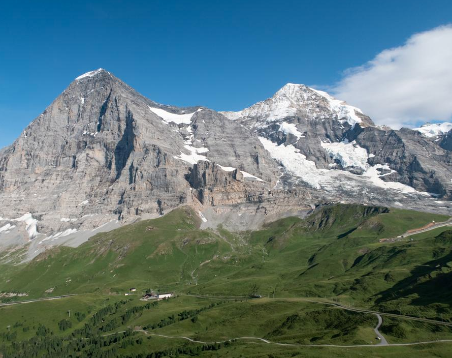
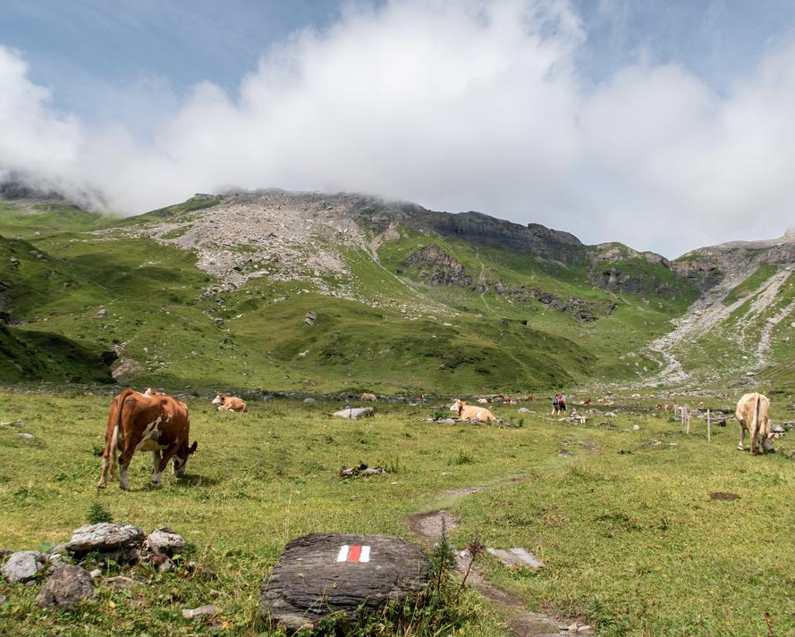
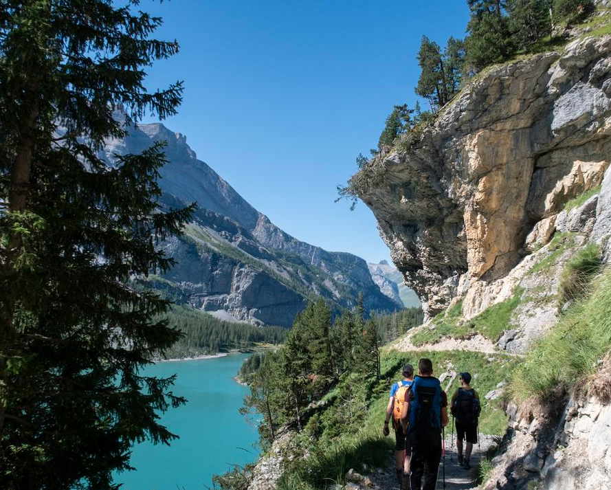
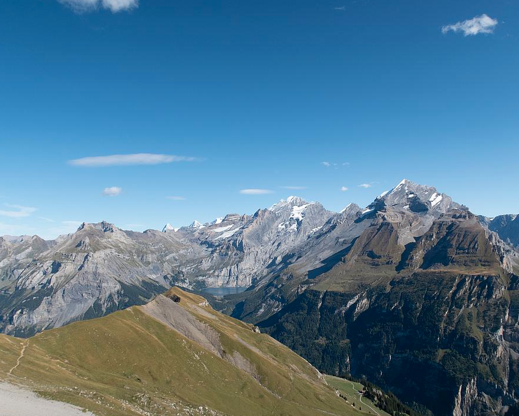
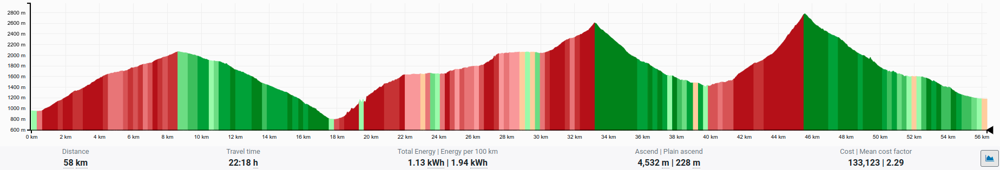

# スイス旅行計画

2022年6月末頃にかけてスイスの山を歩く。

## 概要

- [やりたい事](#やりたい事)
- [やりたくない事](#やりたくない事)
- [日程](#日程)
- [ハイキングコース](#ハイキングコース)
- [選定コース](#選定コース)
- [標高情報](#標高情報)
- [宿泊施設情報](#宿泊施設情報)
- [予算](#予算)
- [GPX](#GPX)
- [コロナ規制](#コロナ規制)
- [TODO-LIST](#TODO-LIST)
- [ハイキングレベル情報](#ハイキングレベル情報)
- [参考リンク](#参考リンク)

## やりたい事

- Eigarを眺める
- Eigarの写真を撮る
- ヒュッテに泊まる（オプション）

## やりたくない事

- Eigarの一般的な観光（登山電車で登っていくやつ）

## 日程

June 2022

| Su | Mo | Tu | We | Th | Fr | Sa |
|----|----|----|----|----|----|----|
|    |    |    | 1  | 2  | 3  | 4  |
| 5  | 6  | 7  | 8  | 9  | 10 | 11 |
| 12 | 13 | 14 | 15 | 16 | 17 | 18 |
| 19 | 20 | 21 | 22 | 23 | 24 | 25 |
| 26 | 27 | 28 | 29 | 30 |    |    |

で、アイディアとしては25日から29日の4泊5日コース。
日付はフレキシブル。個人的には5泊6日にして、Stage11-14を走破するのが良いかなとは思っているが、今回は4泊と決める。
詳細は参加者と要調整事項。

- 出発: 6月25日(土)
- 帰宅: 6月29日(水)

- 25日(土): Grindelwald泊
- 26日(日): Lauterbrunnen泊
- 27日(月): Griesalp泊
- 28日(火): Kandersteg泊

## ハイキングコース

初心者〜中級者以下のコースを想定するほうが良い。
距離が長いとかは、多分問題ない。想定参加者の若いはずなので。
装備品はちょっとアップデートする必要があるかもしれない。

## 選定コース

Via Alpina Stage: 11-13/20の3ステージを選択。独断と偏見。

一応参考にしたのはこのサイトで、20ステージの中で3連続ハイライトコースとされている箇所を考えている。
が、stage14が岩場だけで面白みに欠ける気がしないでもない。そしてStage11は、Eigarのまさに南側を歩くコースなので、王道のような気もする。
[Highlights on the Via Alpina](https://www.myswitzerland.com/en-us/experiences/summer-autumn/hiking/via-alpina/detox-venues/)

更に、[参考リンク](#参考リンク)の厳選32コースの中にstage13が組み込まれていたので、それを含んだものが良いと判断した。

最終的には決めていないが、下記の2つが有力候補。

1. Stage11-13
2. Stage12-14

他の細かいが選定理由として挙げられるモノは、

- Interlakenからアクセスしやすいこと（ハイキング開始と終了がしやすくドイツに帰りやすい事）
- コース風景のバラエテイに富んでいる事
- Eigarが見える所である事
- 宿泊施設が複数ありそうなコース

を検討した。まず初期案ではStage11-13を主軸としてコース設計をする（正確には、どのコースを歩くか、そのハイキングコースへの入出力を決める）

### In (Stage11, to Grindelwald)

出発地はVaihingenとして、下記のような経路でおよそ6時間かかる。

1. Vaihingen
2. BBN
3. Singen
4. Zurich HB
5. Bern
6. Spiez
7. Interlaken West

Interlakenで宿泊してもいいし、ハイキングコースの手前まで行ってから宿泊しても良い。
が、ハイキングを主とするならばGrindelwaldで宿泊して、準備を整えて行くのが良いだろう。なので、初日は移動日とする。

8. Interlaken Ost
9. Grindelwald

この間は、30分程度を初日の移動に入れて、次のようなプランを提案する。

1. 午前中（8時）にVaihingenを出発
2. ちょっと遅い昼ゴハンなどをInterlakenで食べ観光
3. 19時頃、Grindelwaldへ出発
4. 翌朝からGrindelwaldからハイキングコースへ

### Stage: 11

ちょっと大きめの町Grindelwaldから出発し、歯車式鉄道の音を遠くに聞きながら、Eigarのまさに南側を歩く。
観光地化されたコースで、砂利道などがメインになりそう。

[Stage11](https://www.myswitzerland.com/en-ch/experiences/route/via-alpina-11/)

- 出発: Grindelwald
- 終点: Lauterbrunnen
- 距離: 20km
- 時間: 6h40min
- 登り: 1200m
- 下り: 1400m

サンプル画像は上記のリンクより拝借

### Stage: 12

Eigarを南東に眺めつつ出発。小高い丘、そして谷間をあるく。ロードオブザリングのような風景。ここは、緑豊かな草原が広がる。

[Stage12](https://www.myswitzerland.com/en-ch/experiences/route/via-alpina-12/)

- 出発: Lauterbrunnen
- 終点: Griesalp
- 距離: 22km
- 時間: 9h
- 登り: 2000m
- 下り: 1400m

サンプル画像は上記のリンクより拝借

### Stage: 13

標高2840mのホーチュルリ山頂にあるBlüemlisalphütteは一見の価値ありだそう（SAC）。
そこから360度のパノラマビュー（Lake Thun and the Blüemlisalp glacier）が望める。池と氷河の鑑賞。

ハイキングの後、湖に到着したら、冷たい水に足を浸すかのがオススメのアクティビティだそうだ。

[Stage13](https://www.myswitzerland.com/en-ch/experiences/route/via-alpina-13/)

- 出発: Griesalp
- 終点: Kandersteg
- 距離: 17km
- 時間: 7h15min
- 登り: 1450m
- 下り: 1700m

サンプル画像は上記のリンクより拝借

### Stage: 14

絶景Kandersteg Valleyを眺める。このコースは登山と下山コース。
Bunderchrinde Pass to marvelには印象的な岩や地層があり、別の風景が見える。
運が良ければ、アイベックスに出会えるかもとのこと。アイベックスは、ヤギの一種だと思う。

[Stage14](https://www.myswitzerland.com/en-ch/experiences/route/via-alpina-14/)

- 出発: Kandersteg
- 終点: Adelboden
- 距離: 16km
- 時間: 6h50min
- 登り: 1450m
- 下り: 1250m

サンプル画像は上記のリンクより拝借

### Out (Stage13, from Kandersteg)

出発地はKanderstegとして、下記のような経路でおよそ6時間かかる。

1. Kandersteg
2. Spiez
3. Bern
4. Zurich HB
5. Singen
6. Herrenberg
7. Vaihingen

これを踏まえた上で次のような帰宅プランを提案する。

1. Kanderstegを散策、朝・昼ゴハンなど
2. 12時頃、Kanderstegを出発
3. 18時頃、Vaihingenに到着

## 標高情報

Stage11-13の標高情報を可視化した。
[brouter web](https://brouter.damsy.net/latest/#map=11/46.6332/7.8422/standard,route-quality&profile=hiking-beta)を使用し、ルート作成した。実際のSACで見るルートとは微妙に違うが、誤差なので無視する。

## 宿泊施設情報

色々あるのは見かけたが、具体的にどことは決めていない。TODO:決める

上記と同様Stage11-13を主軸として調査する。一応Stage14用の宿泊施設も探し、記録を残す事とする。

### Start Point: Grindelwald泊

6月25日(土)で検索すると、ホテルがほぼ残っていない。と言うか土日だとかなり選択肢が壊滅している。
平日はまだ余裕はありそうだが、決行の如何にかかわらずホテルは抑えよう。TODO:早めのリストアップと予約

### Stage11: Lauterbrunnen泊

選択肢は多少ありそう。とりあえず適当に。一人80ユーロ程度。

[Chalet Rosa B&B](http://chaletrosabb.com/)

### Stage12: Griesalp泊

選択肢はそこまで多くなさそう。オススメに上がってくるホテルの一つが取れればOKと思う。
例えば次のホテル。一泊130CHFが最低でもかかりそう。

[Griesalp Hotels](https://www.myswitzerland.com/en-ch/accommodations/griesalp-hotels/)

ヒュッテに泊まりたいなら、[Rotstockhütte](https://www.rotstockhuette.ch/index.php/en/)もある。
ただここは宿泊ではなく、休憩ポイントとしても良い。

### Stage13: Kandersteg泊

これは道中なのだが、[Blümlisalphütte](https://www.myswitzerland.com/en-ch/accommodations/bluemlisalphuette-sac/)というヒュッテが良いらしい。
ここはコースの途中で宿泊して、帰宅までにもうひと歩きを要するが、大自然の中で泊まるアイディアとしては良いなと思う。

Hotel zur Post, bed & breakfastがとりあえず選択肢。この地域は金額がちょっと高い気がする。
電車でのアクセスも可能と言うもあるだろうし、素晴らしいと言われているStage13に直結している。
ここのホテルは最優先で抑えよう。

[Hotel zur Post, bed & breakfast](https://www.swissqualityhotels.com/en/hotels/switzerland/Kandersteg/Bernerhof/index.aspx)

### Stage14: Adelboden

一応ご参考まで。

[Hotel Steinmattli](https://www.hotel-steinmattli.ch/en/main-page/)

## 予算

ざっくり見積もり: 940 euro(13万程度)

- 往路電車: 60 euro
- 初日ホテル: 130 euro
- stage11 ホテル: 130 euro
- stage12 ホテル: 130 euro
- stage13 ホテル: 130 euro
- 復路電車: 60 euro
- 食事代: 1食(20euro)x3x5=300 euro

ワタナベさんが2022年4月に4泊5日でスイスに旅行したらしい。
その情報によると17万くらいと言っていたので、この概算はそこそこ良い線だろう。

## GPX

下記のアプリで作成予定。TODO:アプリの登録

[SwitzerlandMobility App](https://www.schweizmobil.ch/en/switzerlandmobility-app-e.html)

SwitzerlandMobility App Plusは課金しないと使えないらしい。年間35フラン？だそうだ。

課金が必要ならば実行しよう。やりたいのは、このアプリで提案しているルートをGPXで吐き出したいだけ。
出来るなら、GPXは日付ごとに別ファイルにしたいと思っている。
（めんどくさいので一括ファイルにした）

[GPX data](S11=Grindelwald_S13=Kandersteg_rev2_58km.gpx)

TODO:今回はbrouter webを使用して生成したが元々自転車用のGPX作成サイトなので、登山用ではない。
よって微妙に経路が違う。大きな間違いはない程度に手修正はしたが。もっと良いGPX生成サイトを探してみよう。

## コロナ規制

Swissはほぼ規制が無いはず。TODO:規制確認

## TODO-LIST

- 参加者確認
- 日程調整
- ハイキングコースへの入出力を確認
- コロナ規制確認（主に入国とホテル）
- GPXデータ作成＆確認
- ホテル（ヒュッテ）予約
- 電車予約（どの電車に乗るか確認する）
- 有休申請
- 装備品アップデート
- 荷造り

## ハイキングレベル情報

スイスでは、ハイキングのコースを3種類の色で区分けしている。これによりハイカーは自分の歩いているルートのレベルを把握することが出来る。

- recreational (yellow)
- mountain (red and white)
- alpine (blue and white). 

しかしこれにはサブレベルという物があるそうだ。これを踏まえて頭に入れるべき情報を整理してみよう。
なおこれを定義しているのは、 [Swiss Alpine Club](https://www.sac-cas.ch/en/)（略称SAC）だそうだ。

大切なのは、路上にあるサインの色と岩などにペイントされている色の組み合わせのようだ。
我々はT1以内に収まるコースにしている。なんか青や赤のコースに迷い込まないように注意しよう。

### Hiking trails

- T1: Recreational trails, hiking (yellow)
- T2: Mountain trails, mountain hiking (yellow with red and white points)
- T3: Mountain trails, demanding mountain hiking (yellow with red and white points)
- T4: Alpine routes, alpine hiking (blue with blue and white points)
- T5: Alpine routes, demanding alpine hiking (blue with blue and white points)
- T6: Alpine routes, difficult alpine hiking (blue with blue and white points)

[参考サイト](https://www.swissmountainfun.ch/switzerland-hiking-trails-guide/)

## 参考リンク

今回のルートstage11-13(+14)を歩いている動画。これがイメージしやすい。

その他のリンク集

- [主に使用したスイスのハイキングコースを整理しているサイト](https://www.schweizmobil.ch/en/summer.html)
- [厳選32コース（スイス政府観光局）](https://www.myswitzerland.com/en-ch/experiences/summer-autumn/hiking/32-most-enjoyable-hikes-search/)
- [スイスのハイキングコース(Swiss Hiking Association)](https://www.schweizer-wanderwege.ch/de/wandern/alle-wandervorschlaege)
- [スイスのハイキングコース(SAC)](https://www.sac-cas.ch/en/huts-and-tours/sac-route-portal/)
- [ネットユーザーが構築しているハイキングサイト](https://www.hikr.org/)
